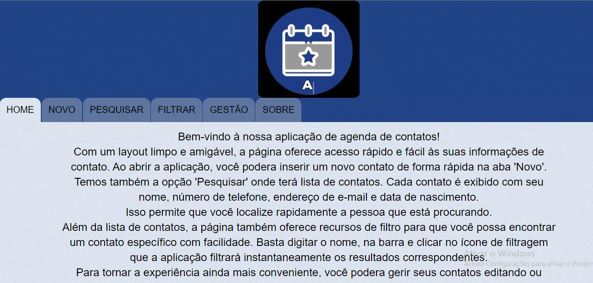

# Portfólio Anderson Motta

                Com um layout limpo e amigável, a página oferece acesso rápido e
            fácil
                às
                suas
                informações de contato.

                Ao abrir a aplicação, você podera inserir um novo contato de forma rápida na aba 'Novo'.
                Temos também a opção 'Pesquisar' onde terá lista de contatos. Cada contato é
                exibido
                com seu nome, número de telefone,
                endereço de
                e-mail e data de nascimento. Isso permite que você localize rapidamente a pessoa que está
                procurando.
                
                Além da lista de contatos, a página também oferece recursos de filtro para que você
                possa
                encontrar um contato específico com facilidade. Basta digitar o nome, na barra e clicar no ícone de
                filtragem que a aplicação filtrará instantaneamente os resultados
                correspondentes.

                Para tornar a experiência ainda mais conveniente, você podera gerir seus contatos editando ou excluindo.

                Em resumo, a aplicação de agenda de contatos oferece uma interface clara e
                acessível
                para
                que você possa gerenciar eficientemente seus contatos. Desde a lista simples até a pesquisa avançada
                , tudo foi projetado para ajudar você a encontrar rapidamente as informações de
                contato
                que
                precisa.
           

## Pré-requisitos

Visual Studio Code
WampServer e Node-Red
Para teste local utilize a extensão LiveServer : ritwickdey.LiveServer

## Uso

Crie um Banco de dados com WampServer: "https://www.youtube.com/watch?v=QXVyCunZN2s&pp=ygUKd2FtcHNlcnZlcg%3D%3D"
Instale e configure Node-Red com banco criado: "https://www.youtube.com/watch?v=QJYwx3zWBlY&t=379s&pp=ygUIbm9kZS1yZWQ%3D"
Abra o arquivo home.html com Live Server.

## Contribuição

Se você tem alguma Sugestão enviar para devandersonmotta@gmail.com com o assunto: "contribuição portfólio" ou entre em contato pelo Linkedin.

## Licença

MIT

## Contato

email: devandersonmotta@gmail.com

linkedin: www.linkedin.com/in/anderson-motta-96b138235
---

